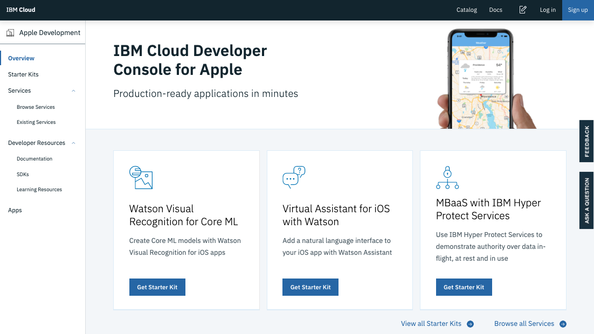
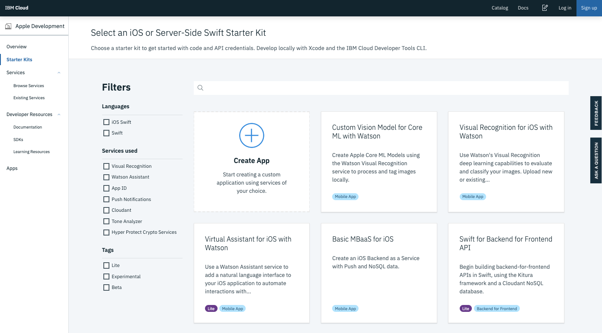
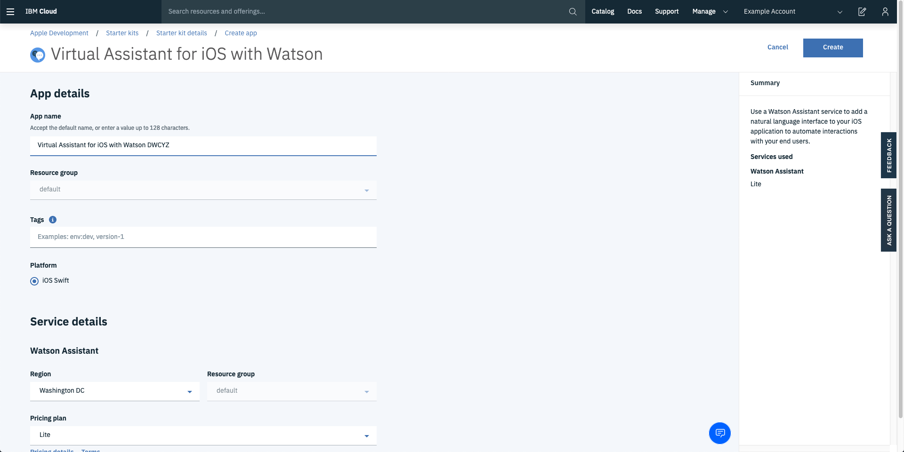
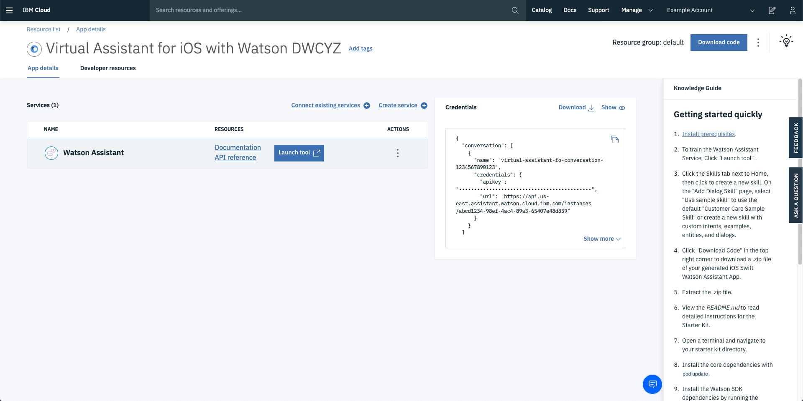
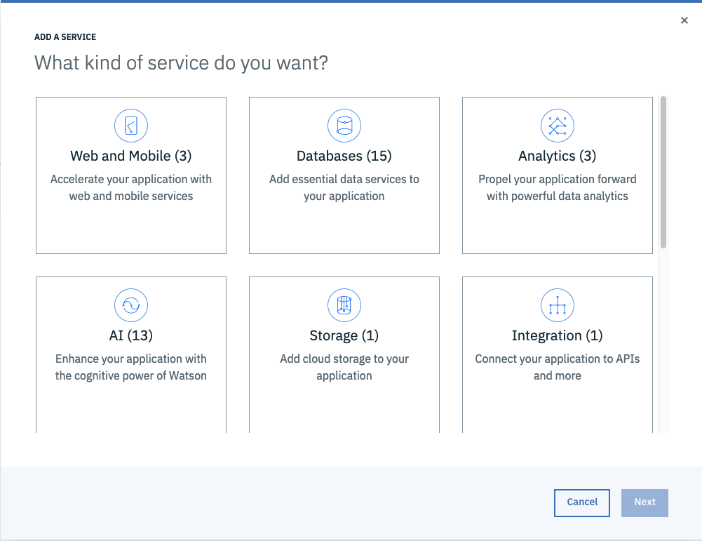
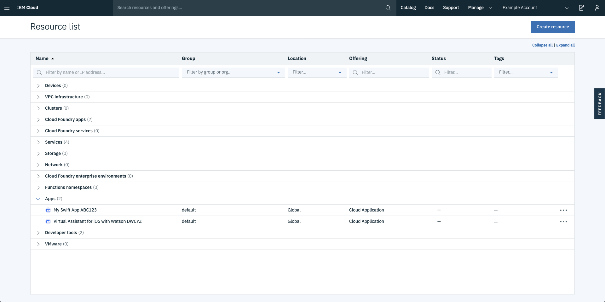

---

copyright:
  years: 2018, 2020
lastupdated: "2020-01-10"

keywords: swift starter kit, apple developer console, download code swift, app details swift, create swift app

subcollection: swift

---

{:new_window: target="_blank"}
{:shortdesc: .shortdesc}
{:screen: .screen}
{:codeblock: .codeblock}
{:pre: .pre}
{:tip: .tip}

# Creating Swift apps with starter kits
{: #starterkits-intro}

The {{site.data.keyword.cloud_notm}} Developer Console for Apple enables Apple developers to create apps from various starter kits, provision and connect key {{site.data.keyword.cloud_notm}}-optimized services, and then quickly download working code or set up for continuous delivery. Users are able to create, view, configure, and manage your app, as well as download your app's code. Using starter kits helps you to quickly evaluate, and test {{site.data.keyword.cloud_notm}} services with a brand new app.

Ready to jump in? Go to the [{{site.data.keyword.cloud_notm}} Developer Console for Apple](https://{DomainName}/developer/appledevelopment/starter-kits){: new_window}  now to get started.
{: tip}

## What is a starter kit?
{: #starterkits-what}

With the {{site.data.keyword.cloud_notm}} developer console, you can choose from various starter kits. Starter kits instruct {{site.data.keyword.cloud_notm}} to dynamically assemble a skeleton production app, in the language of your choice, ready for cloud deployment. Each starter kit embodies a language, a framework, and a pattern for a specific real-world use case that allows reusing code rather than reinventing it.

Starter kits are production-ready, and focus on demonstrating a key pattern implementation by using a runtime (for example Swift). In some cases, starter kits offer a simple user experience to highlight the integration of the service. In other cases, stater kits represent a customizable implementation of a sophisticated use case.

Starter kits contain instructions that allow {{site.data.keyword.cloud_notm}} to automatically produce scaffolded apps with portable code, and specify services to be auto-provisioned when you create an app from the starter kit.

## Using the {{site.data.keyword.cloud_notm}} Developer Console for Apple
{: #starterkits-journey}

The {{site.data.keyword.cloud_notm}} Developer Console for Apple gives you a seamless path to building a Swift starter app for your specific use case. Let's look at the steps that you might take in your journey.

### Overview
{: #overview_screen}

The Overview screen gives you content that is tailored to a set of use cases, such as Watson. From the overview screen, you can see documentation, access educational resources, browse services, see featured starter kits, or link to a larger collection of starter kits. Select **Starter Kits** in the navigation area to step into the Starter Kits view.

{: caption="Figure 1. {{site.data.keyword.cloud_notm}} Developer Console for Apple overview" caption-side="bottom"}

### Choosing a starter kit
{: #starter_kits_view}

The starter kits view shows the available starter kits, which each correspond to a specific use case. Select a starter kit to learn more about what you can do with it and what services are included in it. When you're ready to create an app from a starter kit, click **Create app**.

{: caption="Figure 2. {{site.data.keyword.cloud_notm}} Developer Console for Apple starter kits" caption-side="bottom"}

### Creating an app
{: #create_new_app_view}

From the **Create app** view, you can name your app and edit the default resource deployment information. You can also see the services that are automatically created when you create your app, along with pricing plans and terms for each. To create the app and its related services, click **Create**. If you are not logged in to {{site.data.keyword.cloud_notm}}, you need to do so now.

{: caption="Figure 3. Creating an app in {{site.data.keyword.cloud_notm}} Developer Console for Apple" caption-side="bottom"}

## Viewing app details
{: #app_details_view}

After you create your app, you can view your app's details. The App details page displays a list of services that are configured for your app. For each item in the list, you can see the service name, links to other information, and actions that you can take. By clicking the Actions icon , you can remove the service from your app, open the service's dashboard, and delete the service. Removing a service instance removes the association to this app but does not delete the service instance. Also, the service credentials are consolidated on this view, so you don't have to visit each individual service instance to get them.

{: caption="Figure 4. App details in {{site.data.keyword.cloud_notm}} Developer Console for Apple" caption-side="bottom"}

From the App details page, you can add new or existing services to your app that were not part of the original Starter Kit. Click **Connect existing services** to add an existing service, or click **Create service** to add a new service. The available services depend on the type of app and the services that are available in a region, so not all services are available to associate with all apps.

{: caption="Figure 5. Adding a service to an app in {{site.data.keyword.cloud_notm}} Developer Console for Apple" caption-side="bottom"}

### Downloading your app's code

On the App details page, you can access your app's source code by clicking **Download code** to generate and download the code for your app.

## Viewing your apps
{: #app_list_view}

You can view all of your apps from the {{site.data.keyword.cloud_notm}} resource list, which you can get to from the {{site.data.keyword.cloud_notm}} dashboard or by clicking **Apps** in the Apple Development navigation. Click on an app name row to return to the app details.

{: caption="Figure 6. Viewing your apps in the {{site.data.keyword.cloud_notm}} resource list" caption-side="bottom"}

For more information, visit the [{{site.data.keyword.cloud_notm}} Developer Console for Apple Learning Resources](https://{DomainName}/developer/appledevelopment/learning-resources){: new_window} .
{: tip}
